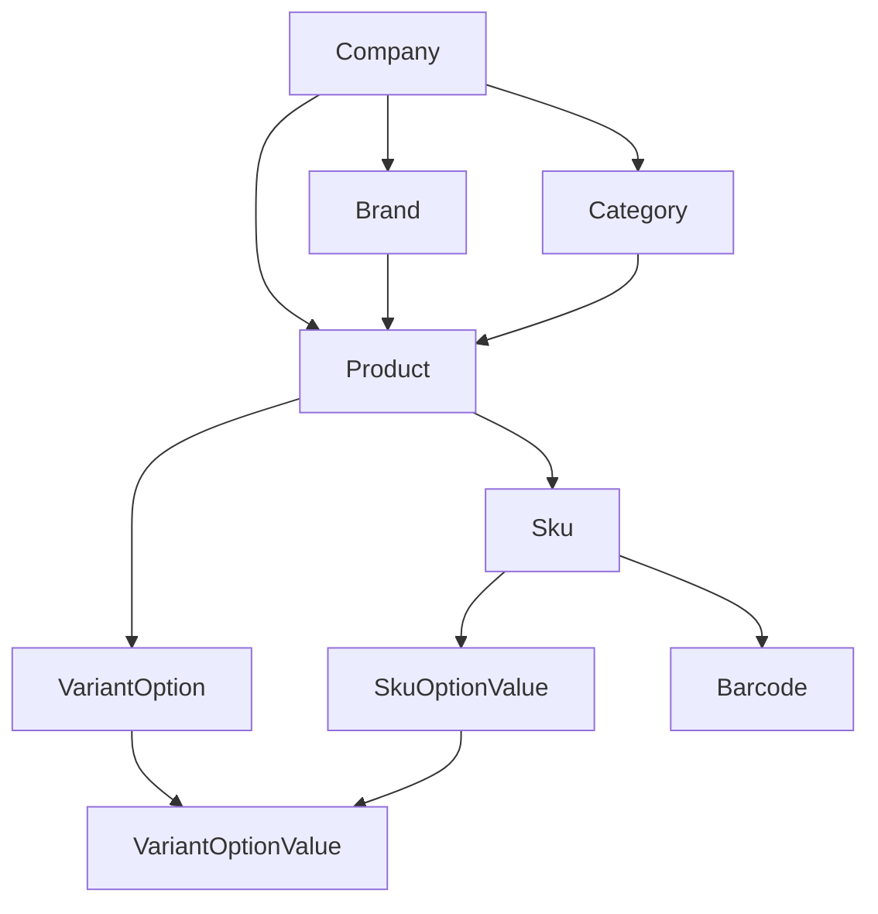

# Catalog Architecture (Phase 1.1 – 1.6)

> **HTTP reference:** Admin REST endpoints, pagination, search/lookup/resolve, and Fanoma examples are documented in [catalog-api.md](./catalog-api.md) (Phase 1.7).

Hector Catalog is the identity foundation for all future operational domains.
**SKU is the operational unit** — not Product.
**Barcode is a scannable identifier that resolves to a SKU** — not to Product.

## Domain boundary

```text
Catalog
│
├── Brand
├── Category (hierarchical)
├── Product
├── VariantOption / VariantOptionValue   ← Phase 1.4
├── SKU (+ SkuOptionValue)               ← Phase 1.4
├── Barcode                              ← Phase 1.5
└── AttributeDefinition / Attribute values ← Phase 1.6
```

Out of scope until later phases: stock, cost, price, supplier, batch/FIFO, warehouse,
marketplace IDs, SEO/slug, images. Bulk Catalog operations (Phase 1.10) are documented in
`docs/catalog-bulk-operations.md` (not CSV/Excel import).

## Conceptual flow (future)

```text
Product
↓
SKU
↓
Barcode
↓
Inventory Batch
↓
Warehouse Stock
↓
Purchase / Sale
```

Product → SKU (+ Variant) → Barcode is implemented through Phase 1.5.
Scan never mutates inventory; Warehouse will call the same BarcodeResolver then issue an Inventory Command.
Attributes enrich Product/SKU specifications only — they are never identity and never required for inventory.

## Relationship diagram

```text
Company
│
├── Brand
│
├── Category
│
└── Product
     ├── Brand?
     ├── Category?
     ├── VariantOption[]
     │    └── VariantOptionValue[]
     └── Sku[]
          └── SkuOptionValue[] → VariantOptionValue
```



## Product vs SKU vs Variant vs Barcode

| Concept | Meaning |
| --- | --- |
| **Product** | Conceptual / commercial identity (e.g. رژ لب جامد فانوما, code `FAN-SL`) |
| **Variant Option** | Product-scoped dimension that differentiates SKUs (e.g. `رنگ`) |
| **Variant Option Value** | Allowed value in that dimension (e.g. `01`…`18`) |
| **SKU** | Exact operational stock/sales identity (`FAN-SL-02`) |
| **Barcode** | External/scannable identifier attached later (Phase 1.5) |

**Product does not own:** inventory, price, cost, supplier, warehouse, marketplace IDs.  
**SKU does not own:** quantity, tester buckets, warehouse location, batch/expiry, purchase/sale price, marketplace listing IDs.

### Example — variant product

```text
Product:
  رژ لب جامد فانوما
  Code: FAN-SL

Variant Option:
  رنگ

Values:
  01 … 18

SKU:
  FAN-SL-02
  Variant: رنگ = 02
```

### Example — simple product

```text
Product:
  پرایمر فانوما
  No Variant Options

SKU:
  FAN-PRIMER-01
```

A Product may have 0, 1, or many SKUs. Operational modules always reference **SKU id**, never Product alone.

---

## Product (Phase 1.3)

Fields: `id`, `companyId`, `name`, `normalizedName`, `code?`, `normalizedCode?`,
`description?`, `brandId?`, `categoryId?`, `status`, timestamps, `archivedAt?`

- Display name: trim + collapse whitespace (Persian/Unicode preserved)
- Optional code uniqueness: `companyId + normalizedCode`
- Brand/Category assignability: ACTIVE (+ Category ACTIVE ancestors)
- Activation blocked if Brand/Category not assignable
- Archive is non-destructive

API: list / detail / create / update / deactivate / activate / archive.  
UI: `/app/catalog/products`, `/app/catalog/products/[id]`

---

## SKU (Phase 1.4)

Fields: `id`, `companyId`, `productId`, `code`, `normalizedCode`, `name?`,
`variantSignature`, `status`, timestamps, `archivedAt?`

### Code

- **Mandatory**; trim + uppercase; characters `A-Z 0-9 - _ .`
- Company-unique forever via `@@unique([companyId, normalizedCode])`
- Archived codes remain reserved (no reuse)
- Never parse business meaning from code format; never use code as FK

### Display name

Optional variant label (e.g. `رنگ 02`). UI may derive `Product — SKU name`.

### Lifecycle

`ACTIVE` / `INACTIVE` / `ARCHIVED`  
Creating or activating an **ACTIVE** SKU requires Product **ACTIVE**.  
Product deactivation/archive does **not** mass-update SKU rows; effective availability = Product state ∩ SKU state.

### Company integrity

`Sku.companyId` must equal `Product.companyId` (composite FK + application checks).

### API

```text
GET    /catalog/skus
GET    /catalog/skus/:id
PATCH  /catalog/skus/:id
POST   /catalog/skus/:id/deactivate|activate|archive

GET    /catalog/products/:productId/skus
POST   /catalog/products/:productId/skus
POST   /catalog/products/:productId/skus/bulk   (all-or-nothing, max 250)
```

Audit: `SKU_CREATED|UPDATED|DEACTIVATED|ACTIVATED|ARCHIVED`  
Events: `catalog.sku.created|updated|deactivated|activated|archived`

---

## Variant Options (Phase 1.4)

Product-scoped dimensions — **not** global attributes and **not** future Product Attributes (Phase 1.6).

### Models

- `VariantOption`: `name`, `normalizedName`, `position`; unique `(productId, normalizedName)`
- `VariantOptionValue`: `value`, `normalizedValue`, `position`, `isActive`; unique `(optionId, normalizedValue)`
- `SkuOptionValue`: join SKU ↔ value; unique `(skuId, optionId)` and `(skuId, optionValueId)`

### Combination rules

1. With options: SKU must select **exactly one active value per option**
2. No two values from the same option
3. Values must belong to the same Product (and Company)
4. Inactive values cannot be newly selected; existing SKU links remain readable
5. `variantSignature` = sorted `optionId:valueId` joined by `|` (server-built; never trust client)
6. Zero options → signature `SIMPLE`; **at most one** SIMPLE SKU per Product
7. Unique forever: `(productId, variantSignature)` — archived combinations stay reserved

### Safe restructuring

- Adding a new Option after SKUs exist → **rejected** (`VARIANT_OPTION_ADD_BLOCKED`)
- Removing Option/Value used by SKUs → not exposed / rejected
- Adding Values → allowed
- Deactivating Values → allowed (blocks new assignment only)

### Bulk generation

UI builds Cartesian products of active values (max **250** combinations).  
Bulk API validates entire batch then writes atomically (max **250** SKUs).

### API

```text
GET    /catalog/products/:productId/variant-options
POST   /catalog/products/:productId/variant-options
PATCH  /catalog/variant-options/:id
POST   /catalog/variant-options/:optionId/values
PATCH  /catalog/variant-option-values/:id
POST   /catalog/variant-option-values/:id/deactivate|activate
```

Audit / events for option and value create/update/activate/deactivate.

### Implementation notes (Phase 1.4)

- **Signature is server-only.** `optionValueIds` is the only client input; the service loads the
  product's own options, validates every ID (cross-product / cross-company IDs are rejected),
  then builds the signature (`variant-selection.util.ts` + `variant-signature.util.ts`).
- **Serialization.** SKU create/update/lifecycle and option/value mutations lock the Product row
  (`SELECT … FOR UPDATE`) inside the transaction, so "add option" can never race "create SKU".
  Unique indexes (`(companyId, normalizedCode)`, `(productId, variantSignature)`) remain the final
  authority and are mapped to `SKU_CODE_ALREADY_EXISTS` / `SKU_VARIANT_ALREADY_EXISTS`.
- **Simple products.** Zero options → `SIMPLE`; a second SKU is rejected with `SKU_SIMPLE_LIMIT`.
  To sell variants, define options **before** creating the first SKU.
- **Activation** (`POST /catalog/skus/:id/activate`) requires an ACTIVE Product and a complete selection
  whose values are all active (`SKU_ACTIVATION_BLOCKED` otherwise). Archived SKUs cannot be
  modified, activated or deactivated (`SKU_ALREADY_ARCHIVED` / `CATALOG_ITEM_ARCHIVED`).
- **Update** may change `code`, `name` and `optionValueIds` (signature recomputed). Audit metadata
  carries `oldCode/newCode` and `oldOptionValueIds/newOptionValueIds`. Retaining an already-linked
  inactive value is allowed; selecting a different inactive value is not.
- **Bulk create** validates the full batch first (size ≤ `BULK_SKU_MAX`, duplicate codes/combinations
  inside the request → `BULK_SKU_DUPLICATE_IN_REQUEST`, DB conflicts, product ACTIVE) and then inserts
  everything in one transaction; one `catalog.sku.created` event and one `SKU_CREATED` audit row per SKU.
  Validation errors carry `details.index` of the offending item where applicable.
- **No option/value deletion.** Structure referenced by SKUs is permanent (FK `RESTRICT`); values are
  retired via `deactivate`. Value batches are normalized (NFKC, Arabic ی/ک folding, case-fold) and
  de-duplicated; labels already present on the option are rejected (`VARIANT_VALUE_EXISTS`).
- **Legacy data.** The Phase 1.4 migration marks the first SKU per product `SIMPLE` and any extra
  pre-variant SKU `LEGACY:<skuId>` so the unique index can be created; `db:seed` re-links them to options.

### Boundaries

SKU/Variant/Barcode stores **no** inventory quantity, price/cost, marketplace listing IDs or
warehouse location. Future flow:

```text
Product → SKU → Barcode → Batch → Inventory / Purchase / Sales → Marketplace mapping
```

**Tester is not another Barcode or SKU.** The same SKU can later exist in inventory buckets
(`SELLABLE`, `TESTER`, `DAMAGED`, …).

**SKU Code** = internal human operational identifier.  
**Barcode** = scanner-readable identifier. They are separate concepts.

Each later module references the **SKU id**, never the Product alone and never the SKU code.

---

## Barcode (Phase 1.5)

```text
Product
↓
SKU
↓
Barcode[]
```

Example:

```text
رژ لب جامد فانوما
↓
FAN-SL-02 / رنگ 02
↓
6261000000023 (EAN-13) + HCT-… (INTERNAL)
```

### Rules

- Belongs to SKU (not Product)
- Multiple barcodes per SKU allowed
- Company-unique `(companyId, normalizedValue)` — including archived (no reuse)
- Cross-company duplicate values allowed
- At most one active **primary** per SKU (partial unique index)
- At most one active **INTERNAL** per SKU (partial unique index)
- Value + type immutable after create → archive + recreate to correct
- First active barcode becomes primary by default
- Archiving a primary promotes the oldest remaining active barcode

### Types & validation

| Type | Validation |
| --- | --- |
| EAN13 | 13 digits + checksum |
| EAN8 | 8 digits + checksum |
| UPC_A | 12 digits + checksum |
| CODE128 | trim + uppercase; scanner-safe alphanumerics |
| INTERNAL | server-generated `HCT-{HEX16}`; rendered as CODE128 |
| OTHER | trim only |

Normalization is type-aware; resolution uses exact `normalizedValue` lookup (indexed).

### Resolver

`POST /catalog/barcodes/resolve` — company-scoped exact match.  
Archived → `BARCODE_NOT_ACTIVE`. Unknown → `BARCODE_NOT_FOUND`.  
Returns SKU + Product identity and status (no inventory fields).

### API

```text
GET    /catalog/skus/:skuId/barcodes
POST   /catalog/skus/:skuId/barcodes
POST   /catalog/skus/:skuId/barcodes/generate-internal
POST   /catalog/barcodes/resolve
POST   /catalog/barcodes/:id/set-primary
POST   /catalog/barcodes/:id/archive
GET    /catalog/barcodes/detect-type   (UI suggestion helper)
```

Audit: `BARCODE_CREATED`, `BARCODE_INTERNAL_GENERATED`, `BARCODE_PRIMARY_CHANGED`, `BARCODE_ARCHIVED`  
Events: `catalog.barcode.created|internal_generated|primary_changed|archived`

### UI

```text
/app/catalog/skus/[id]                 ← SKU identity + barcodes
/app/catalog/skus/[id]/barcodes/print  ← label print (browser)
/app/catalog/barcodes/scan             ← admin scanner test (identity only)
```

Keyboard-wedge scanners are supported as normal keyboard input + Enter. No proprietary SDK.

---

## Brand (Phase 1.2)

Fields: `id`, `companyId`, `name`, `normalizedName`, `code?`, `status`, timestamps, `archivedAt?`  
Uniqueness: `(companyId, normalizedName)`, `(companyId, code)`  
Archive non-destructive; new Product assignment of archived Brand rejected.

## Category (Phase 1.2)

Adjacency list; max depth 20; sibling/root partial unique names;  
`isCategoryAssignable` requires ACTIVE self + ACTIVE ancestors.

## Permissions

`catalog.read` (view) / `catalog.manage` (mutations). Backend is authoritative.

## UI

```text
/app/catalog/products
/app/catalog/products/[id]   ← Product + Variant Options + SKUs + optional specs
/app/catalog/skus/[id]       ← SKU + Barcodes + optional SKU specs
/app/catalog/barcodes/scan   ← Scanner identity test
/app/catalog/attributes      ← Attribute Definition manager (Phase 1.6)
/app/catalog/brands
/app/catalog/categories      ← Category suggested Attributes config
```

React Query keys always include `companyId` (`skuKeys`, `variantKeys`, `barcodeKeys`, `attributeKeys`).

---

## Product Attributes (Phase 1.6)

### Critical optionality rule

> **All Product and SKU Attribute values are OPTIONAL.**
>
> Category Attribute configuration represents recommended/relevant
> specifications only.
>
> Missing Attribute values must never prevent Product/SKU creation,
> editing, activation, barcode assignment, inventory usage, or sales.

Valid Catalog records:

```text
Product A — 0 Attributes
Product B — 2 Attributes
Product C — 15 Attributes
```

### Architecture

```text
Company
├── AttributeDefinition
│   └── AttributeOption[]          (SINGLE_SELECT / MULTI_SELECT)
├── Category
│   └── CategoryAttribute[]        (suggestions only — never required)
├── Product
│   └── ProductAttributeValue[]    (typed; absence = unspecified)
└── SKU
    └── SkuAttributeValue[]
```

### Attribute vs Variant vs Barcode

| Concept | Role |
| --- | --- |
| **Variant Option** | Differentiates SKUs (e.g. رنگ = 02) |
| **Product Attribute** | Describes Product family (e.g. SPF = 50) |
| **SKU Attribute** | Describes exact SKU without changing identity |
| **Barcode** | Scannable identifier → SKU |
| **SKU Code** | Human operational identifier |

Never duplicate Variant identity as an Attribute. Brand, Category, SKU code, Barcode, stock, and price are **not** Attributes.

### Types

`TEXT` · `NUMBER` (+ optional unit metadata) · `BOOLEAN` (true / false / unspecified) · `SINGLE_SELECT` · `MULTI_SELECT`

Scope: `PRODUCT` | `SKU` | `BOTH` — where allowed, **not** where required.

### Value storage

Typed columns (`textValue` / `numberValue` / `booleanValue`) + selection join tables.  
Empty / cleared values are **not** persisted as empty rows.  
`PUT …/attributes` with `[]` clears all values. Product/SKU core APIs never require an `attributes` field.

### Category suggestions

- `CategoryAttribute` = recommended form fields + ordering + visibility
- Ancestor categories contribute suggestions (deduped; nearest wins)
- Product may ignore all suggestions
- Product may add Attributes not assigned to its Category
- Category change does **not** delete existing Attribute values

### Lifecycle

Archive Attribute Definition → no new values; existing Product/SKU values remain readable.  
Type change blocked when options or values exist.  
Options deactivate (not hard-delete) when historical selections exist.

### API (conceptual)

```text
GET/POST/PATCH  /catalog/attributes
POST            /catalog/attributes/:id/archive
POST            /catalog/attributes/:id/options
PATCH/activate/deactivate  /catalog/attribute-options/:id
GET/PUT         /catalog/categories/:id/attributes
GET             /catalog/categories/:id/suggested-attributes
GET/PUT         /catalog/products/:id/attributes
GET/PUT         /catalog/skus/:id/attributes
```

Audit: `ATTRIBUTE_*`, `CATEGORY_ATTRIBUTES_UPDATED`, `PRODUCT_ATTRIBUTES_UPDATED`, `SKU_ATTRIBUTES_UPDATED`  
Events: `catalog.attribute.*`, `catalog.category_attributes.updated`, `catalog.product_attributes.updated`, `catalog.sku_attributes.updated`

### Future

Attributes may later power storefront specs/filters, WooCommerce mapping, and data-quality analytics.  
Completeness indicators (if any) are informational only — never validation gates.  
Inventory identity depends on SKU, not Attribute completeness.

## Critical invariants

SKU remains operational identity. Catalog contains no stock, cost, price, marketplace IDs, or warehouse location. Archive never destroys history. Variant Options differentiate SKUs; Product Attributes describe specifications and are always optional. Do not confuse Attributes with Batches, Barcodes, or marketplace listings.
