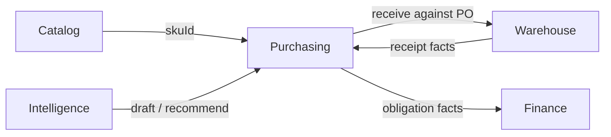

# Purchasing Architecture (Phase 2.1)

Hector Purchasing is the commercial commitment domain for company replenishment.
It answers:

> What did the Company decide to buy, from whom, in what quantity, at what commercial terms, and what remains outstanding to receive?

It does **not** answer stock location, cash balances, or profit.

Phase 2.1 defines boundaries, invariants, lifecycle, money/FX semantics, and module structure.
**No Supplier/PO CRUD, Warehouse, or Finance ledger is implemented here.**

> **Implementation status:** Phase 2 **CLOSED** (2.1–2.16). Through **Tests + Final QA**. Public lifecycle: `DRAFT → APPROVED → ORDERED` and `→ CANCELLED`. Receiving summary states are evidence-backed via the Purchasing↔Warehouse contract — no GoodsReceipt tables yet. Corrections / discrepancies / short-close / purchase-return **intent** are Purchasing-side (`docs/purchase-returns-corrections.md`). HTTP surface consolidated in `docs/purchasing-api.md`. Operator UI in `docs/purchasing-ui.md`. Operational dashboard read model in `docs/purchase-dashboard.md`. Audit + in-process domain events in `docs/purchasing-audit.md` / `docs/purchasing-events.md`. Physical return + stock = Warehouse; refunds/credits = Finance. Phase 3.1 Warehouse architecture: `docs/warehouse-architecture.md` / `docs/warehouse-purchasing-contract.md` (over-receipt default **FORBID**).

---

## Purpose

Establish a Purchasing foundation that can grow through:

```text
2.2  Supplier Master
2.3  Supplier Offers / Quotes
2.4  Purchase Order Core
2.5  Purchase Types
2.6  FX Purchase
2.7  Credit Terms + Due Dates
2.8  Purchase Costs
2.9  Purchase Lifecycle
2.10 Purchase Receiving Contract
2.11 Purchase Returns / Corrections
2.12 Purchasing API                     COMPLETE — see docs/purchasing-api.md
2.13 Purchasing UI                     COMPLETE — see docs/purchasing-ui.md
2.14 Purchase Dashboard                 COMPLETE — see docs/purchase-dashboard.md
2.15 Purchasing Audit + Events          COMPLETE — see docs/purchasing-audit.md, docs/purchasing-events.md
2.16 Tests + Final QA                   COMPLETE — see docs/purchasing-invariants.md
```

without rewriting Catalog, inventing parallel SKU identity, or absorbing Warehouse/Finance authority.

Canonical invariants for Phase 3+: **`docs/purchasing-invariants.md`**.

---

## Scope

### In scope (Purchasing)

- Supplier master (company-scoped party Hector buys from)
- Supplier commercial offers / quotes (historical price observations)
- Purchase Order (commercial commitment) + line items
- Purchase types: `CASH`, `TERM_CREDIT`, `FX_CREDIT`
- Payment terms / due dates (commercial metadata, not settlements)
- Purchase costs (commercial cost of acquiring goods)
- PO lifecycle and editability rules
- Ordered quantity and open/remaining receivable quantity (as Purchasing view of Warehouse receipts)
- Audit + Domain Events for Purchasing facts
- Contracts toward Warehouse receiving and Finance settlement

### Non-goals (explicitly outside Purchasing)

| Concern | Owner |
|---|---|
| Product / SKU / Barcode / Variant master | Catalog (Phase 1) |
| Warehouse, bins, goods receipt documents, stock ledger, stock balance | Warehouse (Phase 3+) |
| Cash/bank accounts, payments, FX wallets, partner capital, profit share | Finance / Profit |
| Sales orders, marketplace listings, sell price | Sales / Marketplace |
| Reorder engine / buy recommendations | Intelligence (Phase 9) |
| Partner equity (Ahmad 60% / Pouria 40%) | Finance / Company Management (later) |

People (Ahmad / Pouria / Hossein) are **not** hardcoded. Responsibilities map to users + membership + RBAC.

---

## Source of truth matrix

| Concept | Source of Truth |
|---|---|
| Product | Catalog |
| SKU | Catalog |
| Barcode | Catalog |
| Supplier | Purchasing |
| Supplier Quote / Offer | Purchasing |
| Purchase Order | Purchasing |
| Ordered quantity | Purchasing |
| Unit price / commercial terms (committed) | Purchasing (historical snapshot on PO) |
| Received quantity **detail** (receipts) | Warehouse |
| Open / remaining receivable (derived) | Purchasing projection **from** Warehouse facts (or live query) — never from stock balance |
| Current stock | Warehouse |
| Payment / settlement | Finance |
| Cash / FX wallet balance | Finance |
| Profit | Profit Engine |

---

## Cross-domain flow

```text
Catalog (SKU identity)
        │ references skuId
        ▼
   Purchasing
   (Supplier, Offer, PO, commercial obligation, ordered qty)
        │
        ├── receiving eligibility / PO line contract ──► Warehouse
        │                                                 │
        │                                                 ▼
        │                                              Stock ledger
        │
        └── commercial obligation fact ──────────────► Finance
                                                         │
                                                         ▼
                                                      Payments
```

Intelligence (future) may recommend quantities into **draft POs** (or future PurchaseRequest). It does not own Purchasing.



**Direction rules**

- Purchasing must not write Warehouse stock tables or Finance ledger tables.
- Warehouse must not mutate PO commercial terms.
- Finance must not rewrite ordered quantities or receipt history.

---

## Domain model (conceptual)

```text
Company
 └── Supplier                          (aggregate root — 2.2)
      ├── SupplierOffer[]              (append-only price observations — 2.3)
      │    └── skuId → Catalog.SKU
      └── PurchaseOrder                (aggregate root — 2.4+)
           ├── PurchaseOrderItem[]     (entity; skuId + commercial snapshot)
           ├── PurchaseCost[]          (entity; PO-level commercial costs — 2.8)
           ├── paymentTerms / dueDate  (value concepts on header)
           ├── purchaseType + currency (header commercial context)
           └── lifecycle status
```

### Aggregate decisions

| Concept | Kind | Notes |
|---|---|---|
| `Supplier` | Aggregate root | Company-scoped; stable UUID identity |
| `SupplierOffer` | Entity under Supplier (or independent append-only root) | New quote = new record; do not overwrite history |
| `PurchaseOrder` | Aggregate root | Commercial commitment document |
| `PurchaseOrderItem` | Entity in PO aggregate | References Catalog `skuId` |
| `PurchaseCost` | Entity in PO aggregate | PO-level first; allocation later |
| Money / FX rate | Value objects | Prisma `Decimal`; never JS `number` authority |
| Receiving progress | Derived / projection | Warehouse is authority for receipt rows |
| `PurchaseReturn` | Future aggregate (2.11) | Separate document; not negative PO qty |
| `PurchaseRequest` | Future optional | Not required for current company scale; Phase 9 may create draft POs |

**Do not create Prisma tables in 2.1.** Models arrive in their implementation phases.

---

## Supplier

- Belongs to one Hector `Company`.
- Stable internal UUID — never name/phone/bank as identity.
- Implemented in **Phase 2.2** — see `docs/supplier-master.md`.
- Optional future typing (`individual`, `wholesaler`, …) deferred (no type enum in 2.2).
- Status: `ACTIVE` / `INACTIVE` / `ARCHIVED` (`PurchasingLifecycleStatus`).
- Contacts: multi-contact + at most one active primary (DB partial unique index).
- Notes: timeline `SupplierNote` (not Audit, not Finance).
- Name duplicates allowed; optional company-scoped `code` unique when set.
- Inactive/archived Supplier: historical POs remain; new POs may be blocked by future rules.
- Extension point: `SupplierSKUCode` mapping (Supplier code → Hector `skuId`) — future; never duplicates Catalog SKU.

---

## Supplier Offer / Quote

Commercial **observation**, not a commitment.

Implemented in **Phase 2.3** — see `docs/supplier-offers.md`.

Conceptual fields:

```text
supplierId
skuId
unitPrice (Decimal string in API; IRR = rials)
currency
purchaseType / paymentTermType / netDays (optional snapshot)
quotedQuantity / minimumQuantity / availableQuantity (optional)
referenceFxRate + explicit currency pair (optional)
quotedAt
validUntil? (optional)
supplierContactId? / notes? / createdById
```

Rules:

- Offers are historical; a new price creates a new offer row (no UNIQUE supplier+sku).
- Latest operational quote = max(`quotedAt`) among non-archived rows.
- Corrections via audited PATCH; archive is soft.
- Converting Offer → PO **copies** commercial terms into the PO snapshot; PO must not dynamically read current offer for historical display.
- Comparison/analytics beyond “latest per supplier for SKU” are future read models.

---

## Purchase Order

### Identity

- Primary key: UUID.
- Human-readable number: company-scoped sequence (e.g. `PO-1405-000123`) — **not** the PK.
- Numbering strategy (when implemented): database-backed company sequence / transactional counter. **Forbidden:** `COUNT(*)+1` or unlocked `MAX+1`.

### Header (commercial context)

Recommended: **one PO = one commercial currency + one purchase type context**.

```text
companyId
supplierId
number (human)
status (lifecycle)
purchaseType: CASH | TERM_CREDIT | FX_CREDIT
currency (CurrencyCode: IRR | USD — reuse Catalog/Company enum)
paymentTermType: IMMEDIATE | NET_DAYS | FIXED_DATE
netDays? / termBasis? (ORDER_DATE) / dueDate?
obligationAmount? + obligationCurrency?                 (FX_CREDIT authoritative)
referenceFxRate? + referenceFxBaseCurrency? + referenceFxQuoteCurrency?   (FX_CREDIT)
referenceFxRateAt?                                       (optional agreed-rate timestamp)
expectedDeliveryAt?
external references / supplier invoice number? (optional metadata)
notes?
createdBy / approvedBy / approvedAt / orderedAt (attribution)
version? (optimistic concurrency recommendation — see below)
```

### Items

```text
purchaseOrderItemId
skuId                    ← required (not Product-only)
quantity                 ← integer units > 0 (Phase 2)
unitPrice                ← Decimal in PO currency (or foreign unit price for FX)
snapshots:
  skuCode
  productName
  variantLabel
  productId (optional denormalized convenience)
```

**Why SKU:** shade/size differentiation is operationally purchased (e.g. 18 lipstick shades).

**Duplicate SKU lines:** initial rule — **at most one line per `skuId` per PO**. Different commercial terms for same SKU → separate POs or future explicit multi-line exception.

**UOM:** integer sellable units for Phase 2. Weight/volume UOM deferred unless Catalog introduces it.

### Totals (conceptual)

Keep separate:

```text
commercialObligationAmount   (in PO.currency — authoritative for settlement)
referenceLocalValuation      (optional; IRR using reference FX — analysis only)
purchaseCostsTotal
grandCommercialTotal         (obligation + costs in commercial currency when same currency)
```

Never merge USD obligation into a rewritten IRR debt when FX moves.

---

## Historical snapshot strategy

Committed POs are historical commercial documents.

On commit (`ORDERED` at latest; optionally at `APPROVED`):

- Persist Supplier display snapshot (name) on PO header.
- Persist SKU/Product/variant labels on each line.
- Persist unit prices, currency, purchase type, terms, FX reference.

Later Catalog rename / Supplier rename / offer change **must not** rewrite those snapshots.
Stable IDs remain authority for joins; snapshots preserve human readability.

---

## Money model

Hector already forbids floating-point money authority (`docs/architecture/README.md`).
Company already has `CurrencyCode { IRR, USD }`.

| Concern | Decision |
|---|---|
| Storage | PostgreSQL / Prisma `Decimal` |
| API JSON | Decimal as **string** (never JS number for authority) |
| Canonical company currency | `IRR` (already `Company.baseCurrency`) |
| Toman | **Display/UX only**: 1 Toman = 10 IRR. Never store Toman as a second authoritative currency without an explicit conversion field |
| IRR precision | Scale 0 (rial integers) for commercial unit prices/totals in IRR |
| USD precision | Scale ≥ 2 for unit prices/totals |
| FX rate | `Decimal` with higher scale (e.g. ≥ 6); pair always explicit: `baseCurrency` / `quoteCurrency` / `rate` |
| Large values | Decimal supports billions of Toman / large IRR without JS `Number` loss |

UI may show Toman; API/docs must label unit clearly when displaying converted values.

---

## Purchase types

| Type | Meaning | Obligation | Due |
|---|---|---|---|
| `CASH` | Payment expected immediately / at purchase per policy | Amount in PO currency (typically IRR) | Immediate (`IMMEDIATE`) |
| `TERM_CREDIT` | Supplier credit | Amount in PO currency | `NET_DAYS` or `FIXED_DATE` → `dueDate` |
| `FX_CREDIT` | Foreign-currency commercial debt | **Foreign currency amount** (e.g. USD) | Terms/due as agreed |

### FX_CREDIT critical rule

If obligation is `1,000 USD`, the Company owes **1,000 USD** until Finance settles it — even if the reference rate was 205,000 Toman/USD and later market is 235,000.

`referenceFxRate` is for historical valuation / analysis / estimated local value only.
It must **not** replace the foreign obligation.

Phase 2.6 detail (MODEL A, IRR/Toman, derived `referenceLocalValuation`, Finance boundary): `docs/fx-purchases.md`.

### FX line pricing

Prefer **line-level foreign unit price** × quantity → foreign line total, summed to PO foreign obligation.
Optionally store total foreign obligation on header as derived/check field.
Do not model FX PO as “IRR price only”.

### Payment terms

```text
IMMEDIATE
NET_DAYS   (+ netDays, termBasis, dueDate server-calculated)
FIXED_DATE (+ dueDate explicit)
```

Due date ≠ payment happened. Settlement lives in Finance.

Phase 2.7 detail (calendar days, due status, Finance boundary): `docs/credit-terms.md`.

---

## Purchase costs

Commercial costs of acquisition (courier, freight, purchase fee, transfer fee, packaging, customs, other).

- Owned commercially by Purchasing (`PurchaseOrderCost` on PO) — Phase 2.8.
- Actual payment of those costs owned by Finance.
- Phase 2 default: **PO-level** normalized cost rows; future allocation to lines for landed cost / FIFO (Profit/Warehouse) must remain possible.
- Extensible type enum: `COURIER | FREIGHT | PURCHASE_FEE | TRANSFER_FEE | PACKAGING | CUSTOMS | OTHER`.
- Detail: `docs/purchase-costs.md`.

---

## Lifecycle

Separate axes (do **not** combinatorially encode):

```text
1) Purchase lifecycle (Purchasing)
2) Receiving progress (derived from Warehouse)
3) Financial settlement (Finance — future)
```

Example valid combination:

```text
lifecycle: ORDERED
receiving: PARTIAL
finance: UNPAID
```

### PO lifecycle states

```text
DRAFT
APPROVED
ORDERED
PARTIALLY_RECEIVED
RECEIVED
CLOSED          ← ordered complete enough for ops (incl. short-close)
CANCELLED
```

`PAID` / `PARTIALLY_PAID` are **not** PO lifecycle states.

### Transitions

> **Phase 2.9 implements** the public graph below. Receiving transitions are reserved for Phase 3 Goods Receipt evidence — see `docs/purchase-lifecycle.md`. `ORDERED → CANCELLED` is allowed until receipts exist; then it must be restricted and superseded by close/short-close.

```text
DRAFT ──approve──▶ APPROVED ──order──▶ ORDERED
                      │                   │
                      └──── cancel ───────┘──▶ CANCELLED
ORDERED ──(Phase 3)──▶ PARTIALLY_RECEIVED / RECEIVED
```

| From | To | Command | Typical permission | Notes |
|---|---|---|---|---|
| DRAFT | APPROVED | `approve` | `purchasing.approve` | Internal approval |
| DRAFT | CANCELLED | `cancel` | `purchasing.cancel` | Reason optional |
| APPROVED | ORDERED | `order` (alias `markOrdered`) | `purchasing.manage` | Commitment with supplier |
| APPROVED | CANCELLED | `cancel` | `purchasing.cancel` | Reason required |
| ORDERED | PARTIALLY_RECEIVED | system/react to Warehouse receipt | — | Not a free PATCH |
| ORDERED | RECEIVED | system when remaining receivable = 0 | — | |
| ORDERED | CLOSED | `close` (short-close remainder) | `purchasing.manage` | Future |
| ORDERED | CANCELLED | `cancel` | `purchasing.cancel` | Only if **no** accepted receipts |
| PARTIALLY_RECEIVED | RECEIVED | system | — | Remaining = 0 |
| PARTIALLY_RECEIVED | CLOSED | `close` | `purchasing.manage` | Future |
| RECEIVED / CLOSED / CANCELLED | — | — | — | Terminal for commercial edits |

### Editability

| State | Editable |
|---|---|
| DRAFT | Full commercial edit (supplier, type, currency, lines, terms, costs) |
| APPROVED | Restricted: prefer amend-as-new-draft or revert to DRAFT only if policy allows; default: limited notes/metadata |
| ORDERED | Commercial terms **immutable**; notes/external refs may update; quantity/price changes require explicit amendment/correction (future) |
| PARTIALLY_RECEIVED / RECEIVED / CLOSED / CANCELLED | Historical; no silent commercial rewrites |

After supplier commitment (`ORDERED`), do not silently change `1000 → 800`. Prefer amendment / correction / cancel-remainder documents (2.11+).

> **2.4 editability:** DRAFT = full edit (supplier/currency locked while items exist); APPROVED and ORDERED = `notes` / `expectedAt` only; CANCELLED = immutable. Snapshots (supplier name/code, SKU code, product name, variant label, product id) are frozen at `markOrdered`.

### Draft deletion

- Prefer `CANCELLED` for anything that left DRAFT meaningfully.
- Uncommitted empty DRAFT may be hard-deleted (implementation choice in 2.4).
- Committed commercial documents: **never hard-deleted** in normal flows.

### Concurrency

- PO numbering: transactional company sequence.
- State transitions: enforce in application layer; recommend `version` (optimistic) on PO for concurrent approve/order/cancel.
- Receiving updates must be idempotent per Warehouse receipt identity.

---

## Warehouse receiving contract

**Phase 2.10 deliverable:** `docs/purchase-receiving-contract.md` + Purchasing port
`PurchaseReceivingContract` (`apps/api/src/modules/purchasing/contracts/`).

Purchasing exposes eligibility and derives receiving summary status. Warehouse owns receipt documents and accepted quantities. Warehouse must **not** Prisma-update `PurchaseOrder.status` directly.

```text
Catalog → Purchasing → Warehouse (uses Purchasing contract)
```

Conceptual contract Warehouse needs:

```text
purchaseOrderId
purchaseOrderItemId
companyId
skuId
orderedQuantity
alreadyReceivedAcceptedQuantity   // from Warehouse aggregates (not Purchasing columns)
remainingReceivableQuantity       // ordered - accepted - closedRemaining
status eligibility                // ORDERED | PARTIALLY_RECEIVED
```

### Partial / multiple receipts

Mandatory. One PO → many Warehouse receipts over time.

```text
ordered 1000
receipt#1 accepted 600
receipt#2 accepted 370
receivedAccepted 970
remaining 30
```

Ordered quantity is never rewritten by receipts.

### Over-receiving

**Initial policy: reject** accepted quantity that would exceed remaining receivable (strict).
Tolerance/override is a future explicit policy, not silent allow.

### Under-receiving / close remainder

Supported. Closing remaining 30 must **not** pretend 1000 were received:

```text
ordered 1000
accepted 970
closedRemaining 30
→ lifecycle CLOSED (or RECEIVED only when remaining receivable = 0 without short-close)
```

### Delivered vs accepted

Architecture must allow future split:

```text
delivered / rejected / accepted
```

Do not assume delivered == accepted.

### Batch

Batch/lot is Warehouse/receiving operational data. Purchasing may later store supplier batch metadata on lines/receipts but does not own stock batch state.

### Returns

Future `PurchaseReturn` (2.11): append-only.  
`received 1000` + `returned 100` — do **not** rewrite history to `received 900`.

---

## Derived received quantity

**Recommendation:** Warehouse is system of record for receipt lines.

Purchasing UI fields `receivedQuantity` / `remainingQuantity`:

1. **Preferred initial:** query/aggregate from Warehouse receiving API/service within the modular monolith (same DB, clear module boundary).
2. **Optional later:** event-maintained projection on PO/PO Item updated by `warehouse.receipt.recorded` handlers — still not inventing stock.

Never derive remaining from current stock balance (sales/theft/adjustments would corrupt Purchasing).

---

## Finance boundary

Purchasing may state:

```text
PO-123 · Supplier A · obligation 1,000 USD · due 2026-10-13
```

Finance later states:

```text
paid 400 USD · remaining 600 USD
```

Purchasing does **not** own payment allocation, cash accounts, or partner capital.
Architecture must allow partial payments without Purchasing payment rows.

---

## RBAC (planned — register when features land)

```text
purchasing.read
purchasing.create      # draft create / offers record
purchasing.manage      # edit draft, mark ordered, costs, close remainder
purchasing.approve
purchasing.cancel
```

Warehouse roles (future) should gain **read ordered PO + receive** without `purchasing.manage` (cannot change price/supplier/terms).

Do not hardcode Ahmad/Pouria/Hossein. Map via roles.

Commercial price sensitivity: field-level restriction is optional future; module-level permissions first.

---

## Audit + Domain Events (Phase 2.15)

```text
             ┌──────────────────┐
             │    Purchasing    │
             └────────┬─────────┘
                      │
               Domain mutation
                      │
             ┌────────┴─────────┐
             │                  │
          Audit             Domain Event
             │                  │
             ▼                  ▼
      Traceability        Event Dispatcher (in-process)
                                │
                   ┌────────────┴────────────┐
                   │                         │
              Phase 3                    Phase 4
              Warehouse                  Finance
              FUTURE                     FUTURE
```

- Audit catalog: **`docs/purchasing-audit.md`**
- Event catalog + reliability limits: **`docs/purchasing-events.md`**
- Same transaction + `commitThenPublish` as Catalog (no Kafka / outbox yet).
- Business timeline: `GET /purchasing/purchase-orders/:id/activity` (projection of Audit).
- Receiving transitions (`partially_received` / `received`) remain Warehouse-owned — no Purchasing public emit until Phase 3 evidence exists.
- Purchasing does **not** import Warehouse/Finance modules.

---

## Multi-tenancy

Every Purchasing row is `companyId`-scoped.

Forbidden:

```text
Company A PO + Company B Supplier
Company A PO + Company B SKU
```

Enforce with composite FK patterns where Prisma allows (`skuId, companyId`), plus application checks (Catalog style). Foreign IDs → safe not-found / validation errors; no existence leak.

---

## Module structure (NestJS)

Align with Catalog modular monolith style (not heavy DDD ceremony):

```text
apps/api/src/modules/purchasing/
├── purchasing.module.ts
├── purchasing.controller.ts          # GET /purchasing/summary + /dashboard
├── purchasing-summary.service.ts     # lightweight counts (2.12)
├── purchase-dashboard.service.ts     # operational dashboard read model (2.14)
├── purchase-dashboard.metrics.ts     # status sets, range, due buckets
├── purchasing.constants.ts
├── suppliers.controller/service.ts
├── supplier-offers.controller/service.ts
├── purchase-orders.controller/service.ts
├── purchase-order-costs.*
├── purchase-order-corrections.*
├── purchase-discrepancies.*
├── purchase-returns.*
└── contracts/purchase-receiving.*    # internal Phase 3 contract (not public HTTP)
```

### Dashboard read-model layer (Phase 2.14)

```text
UI /app/purchasing  (filters in URL)
        │
        ▼
GET /purchasing/dashboard   ← PostgreSQL aggregates (groupBy/count/bounded lists)
        │
        ├── KPIs / attention / open / due / unfulfilled
        ├── Period trend + supplier / type / currency breakdown
        └── Canonical PO truth (post-correction); no Finance/Warehouse inventions
```

Not introduced: Kafka, Elasticsearch, ClickHouse, materialized analytics service.  
Future scale (documented only): materialized views, cached aggregates, analytics warehouse.  
Metric dictionary: **`docs/purchase-dashboard.md`**.

### API layer (Phase 2.12+)

```text
Next.js UI
    │
    ▼
Purchasing HTTP API (/api/v1/purchasing/*)
    │
    ▼
Application Services (+ dashboard read model)
    │
    ▼
Purchasing Domain
    │
    ├── Supplier / Offers / PO / Costs
    ├── Lifecycle / Corrections / Returns
    └── Receiving Contract (internal)
    │
    ▼
Repositories (Prisma)
    │
    ▼
PostgreSQL
```

Full endpoint matrix, RBAC, filters, money serialization, and error codes: **`docs/purchasing-api.md`**.

HTTP is for UI/external clients. Warehouse/Finance must prefer typed application contracts inside the modular monolith — not call Purchasing over HTTP.

Prefer intentful commands after DRAFT over `PATCH { status }`. No public receive endpoints.

### Frontend boundary (Phase 2.13–2.14)

```text
apps/web Purchasing workspace
    │  company-scoped React Query keys
    │  permission-gated actions
    │  Persian / RTL operational screens
    ▼
Purchasing HTTP API (Phase 2.12)
    │
    ▼
Domain services (authority for lifecycle, money, corrections, returns)
```

UI responsibilities:

- Present purchasing facts (suppliers, offers, POs, costs, due dates, corrections, discrepancies, return **intent**)
- Hide invalid actions using permissions + `availableActions`, while still treating the API as authoritative
- Keep Catalog as the only product/SKU identity source (remote SKU search)

UI must **not**:

- Mark PO received / set received qty / move stock / select warehouse locations
- Mark paid / create supplier payment or refund / alter partner capital / compute profit
- Recommend reorder quantities from sales
- Duplicate Product Master or Supplier Master as free-text authority

Operator guide: **`docs/purchasing-ui.md`**.

---

## Database planning (future migrations — not 2.1)

Likely models: `Supplier`, `SupplierOffer`, `PurchaseOrder`, `PurchaseOrderItem`, `PurchaseCost`, company `PurchaseOrderSequence`.

Likely constraints:

- company FKs; supplier/PO same company
- unique `(companyId, number)` on PO
- quantity > 0 (check)
- unique `(purchaseOrderId, skuId)` 
- Decimal money columns

Likely indexes (when queries exist):

```text
(companyId, status)
(companyId, supplierId)
(companyId, orderedAt)
(companyId, dueDate)
(companyId, number)
(skuId) on PO items
(supplierId, skuId, quotedAt) on offers
```

---

## Future intelligence compatibility

Phase 9 needs:

```text
open purchase quantity (ordered − accepted − closedRemaining) by skuId
supplier quote history
lead time (optional future fields)
```

Purchasing must expose these as queryable facts without embedding recommendation logic.

Phase 9 may create **DRAFT** POs (or future PurchaseRequest → draft PO). No redesign required if draft creation API stays open.

---

## Future extensions (FUTURE)

```text
Supplier lead time
Supplier SKU mapping
PurchaseRequest document
Landed-cost allocation engine
Partial payments (Finance)
FX exposure dashboards
Excel/invoice import
Document/file storage for supplier invoices
Multi-currency lines inside one PO
Over-receipt tolerance policy
Damaged/rejected receiving split
```

---

## Scenario validation

| # | Scenario | Result |
|---|---|---|
| A | Cash PO 1000 × 493,000 Toman (store as IRR) | YES |
| B | Term credit 4440 × 525,000 + due date | YES |
| C | FX 1000 USD + reference rate; debt stays USD | YES |
| D | Partial multi-receipt without editing ordered qty | YES |
| E | Close remaining 30 without faking receive | YES |
| F | Archived SKU; historical PO readable | YES (skuId + snapshot) |
| G | Product rename; PO understandable | YES (snapshot) |
| H | Supplier rename; PO understandable | YES (snapshot) |
| I | Cross-company Supplier/SKU | NO |
| J | Phase 9 recommend → draft PO | YES |
| K | Warehouse receive without price edit permission | YES (RBAC) |
| L | Finance partial pay without Purchasing payments | YES |
| M | Courier cost → future landed cost | YES |
| N | Return after receipt without rewriting receipt | YES (PurchaseReturn) |

---

## Ownership review matrix

| Concern | Owner | Architecture ready? |
|---|---|---|
| Supplier | Purchasing | YES |
| Quote | Purchasing | YES |
| PO | Purchasing | YES |
| Ordered qty | Purchasing | YES |
| SKU identity | Catalog | YES (Phase 1) |
| Barcode identity | Catalog | YES (Phase 1) |
| Receipt detail | Warehouse | YES (contract defined; impl later) |
| Stock | Warehouse | YES (boundary) |
| Payment | Finance | YES (boundary) |
| Cash | Finance | YES (boundary) |
| FX obligation origin | Purchasing | YES |
| FX settlement | Finance | YES (boundary) |
| Profit | Profit Engine | YES (boundary) |

---

## Invariants (checklist for implementers)

1. Every Purchasing entity belongs to a Company.  
2. PO Supplier and all SKUs are same-company.  
3. PO Item references Catalog `skuId`.  
4. Quantity > 0 for purchase lines.  
5. Money/FX use `Decimal` authority; API strings.  
6. Currency and purchase type explicit on PO.  
7. FX obligation remains foreign-denominated.  
8. Committed PO commercial history is preserved (snapshots + no silent edits).  
9. Received detail is not invented from stock.  
10. Payments and stock are not stored in Purchasing.  
11. No hard-delete of committed POs.  
12. Audit/Event share Catalog/Phase 0 transaction guarantees.

---

## Worked examples (fixtures only — never hardcoded in logic)

**Cash (display Toman → store IRR):**  
1,000 × ESS-MASCARA @ 493,000 Toman/unit → unit price `4,930,000` IRR (or store Toman only in UI conversion). Prefer documenting conversion at API boundary: if UI collects Toman, convert ×10 to IRR for storage when `currency=IRR`.

**Practical Hector convention for IRR POs:** store amounts in **IRR**; UI may edit/display Toman by ÷10/×10 with explicit labeling.

**Term credit:** 4,440 × 525,000 Toman/unit, `TERM_CREDIT`, `NET_DAYS=30`, dueDate set.

**FX credit:** 1,000 units × 1.00 USD = **1,000 USD** obligation; `referenceFxRate` 205,000 (USD→IRR or Toman—pair must be explicit, e.g. USD/IRR rate = 2,050,000 if Toman display was 205,000). Document pair on the PO.

---

## Module skeleton (2.1 code)

`PurchasingModule` is registered empty (no controllers/Prisma models) so Phase 2.2+ has a stable Nest boundary. Planned permission string constants live in `purchasing.constants.ts` but are **not** synced into the permission catalog until features register them (same pattern Catalog used when introducing `catalog.*`).
